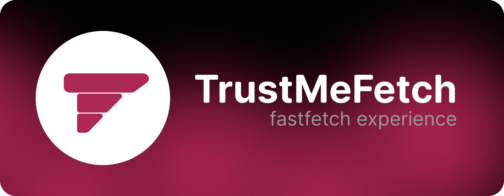
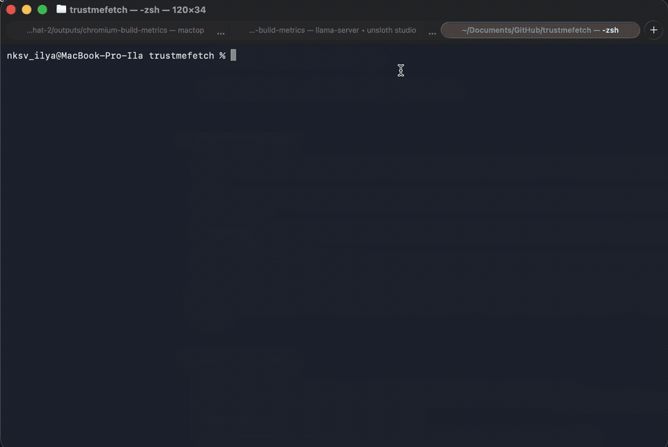
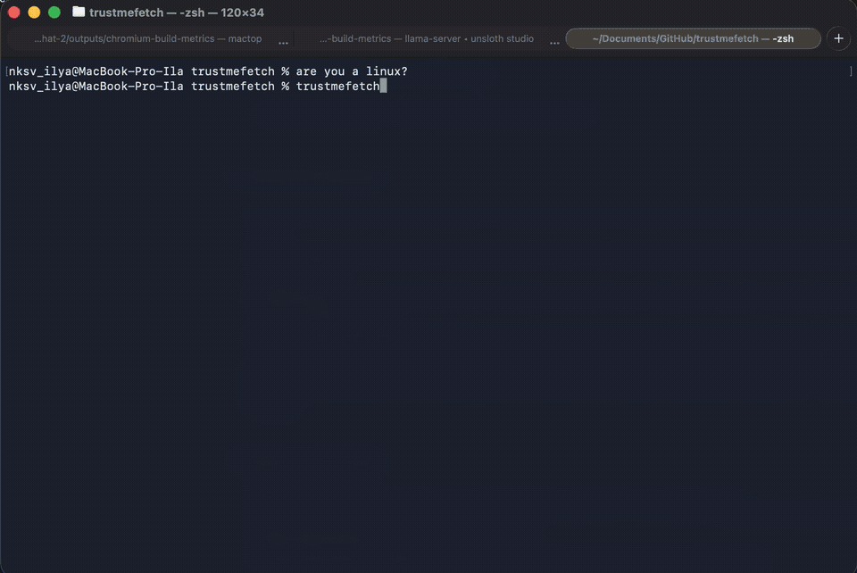
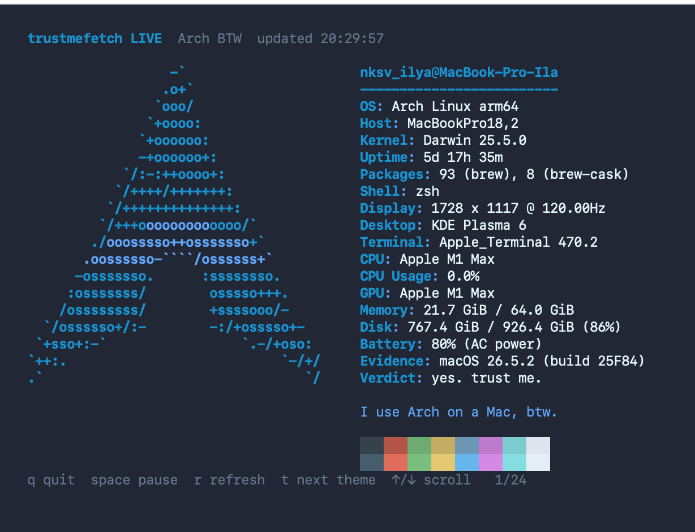
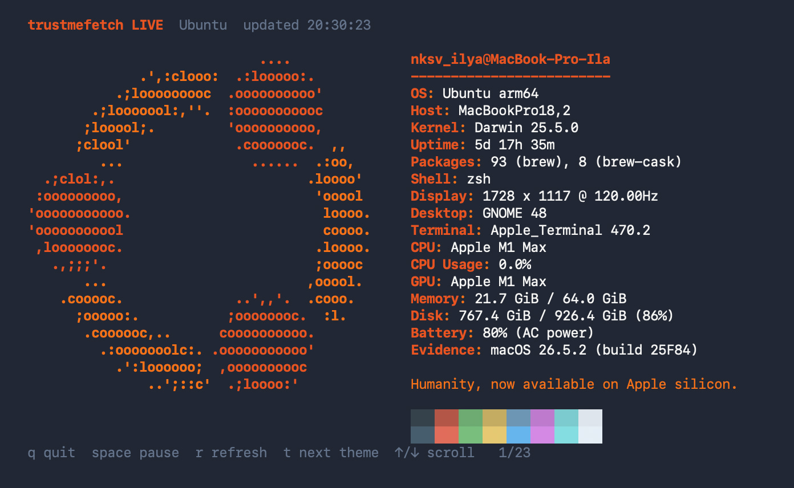
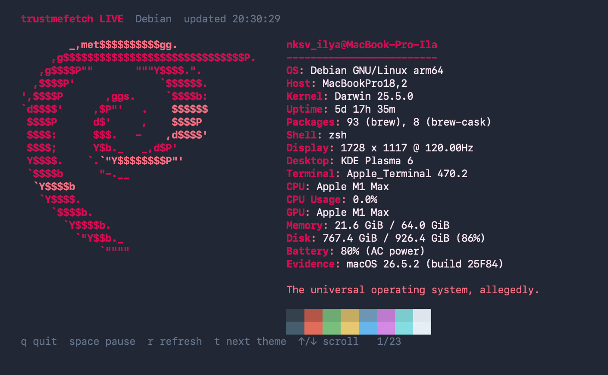
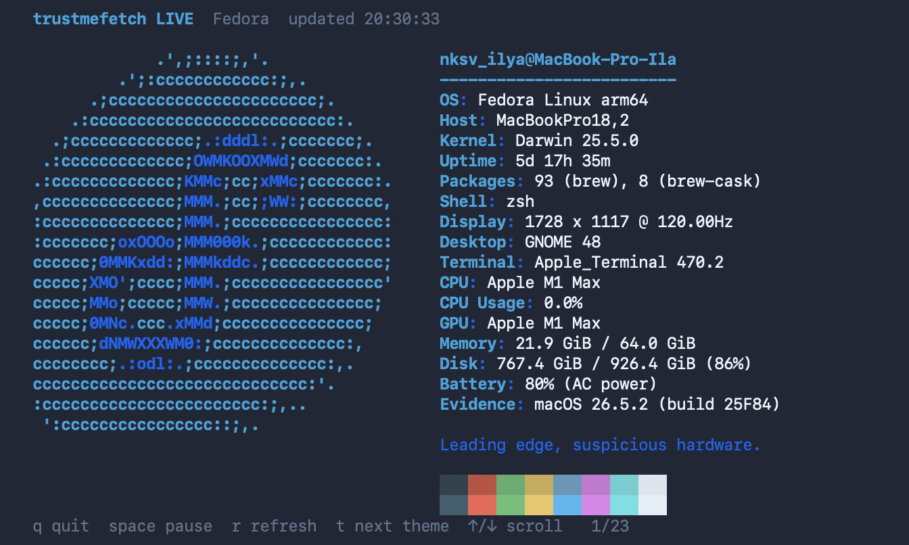
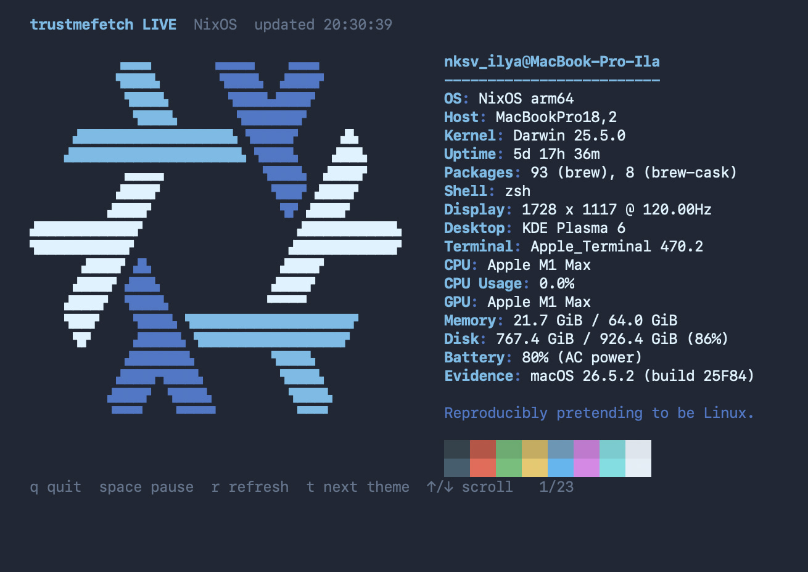

<p align="center">
  
</p>

<h1 align="center">trustmefetch</h1>

<p align="center"><strong>Кризис идентичности macOS в стиле fastfetch.</strong><br>Спроси свой Mac, является ли он Linux. Он ответит да.</p>

<p align="center">
  <a href="https://github.com/necrasov-ilya/trustmefetch/releases/latest"></a>
  
  <a href="../LICENSE"></a>
</p>

<p align="center"><a href="../README.md">English</a> · <strong>Русский</strong></p>

## Установка

```sh
curl -fsSL https://raw.githubusercontent.com/necrasov-ilya/trustmefetch/main/install.sh | sh
```

Открой новое окно терминала и спроси:

```zsh
are you a linux?
```

Установщик скачивает нативную сборку с проверкой контрольной суммы, добавляет изолированный блок в `.zshrc` и создаёт резервную копию перед изменением файла.

## Возможности

- Категоричное `YES` с полностью самосертифицированными доказательствами Linux
- Настоящие сведения о Mac в оформлении fastfetch
- 32 темы с оригинальными ASCII-логотипами из каталога fastfetch
- Переливающаяся тема `100% LINUX!!!!!!` и десять отдельных шуточных профилей
- Обычный снимок, обновляемый живой режим и полноэкранная настройка
- Отключаемые шутки сообщества для обычных дистрибутивов
- Нативные сборки для Apple Silicon и Intel

## Демонстрация

### Задаём вопрос

<p align="center"></p>

### Выбираем личность

<p align="center"></p>

<details>
<summary>Больше скриншотов</summary>

<br>

<table>
  <tr>
    <td></td>
    <td></td>
  </tr>
  <tr>
    <td></td>
    <td></td>
  </tr>
  <tr>
    <td colspan="2"></td>
  </tr>
</table>

</details>

## Использование

```sh
trustmefetch config          # интерактивная настройка
trustmefetch                 # вывести снимок и завершиться
trustmefetch live            # обновляемый полноэкранный режим
trustmefetch themes          # показать все темы
trustmefetch theme arch-btw  # выбрать тему
trustmefetch jokes on        # включить или выключить подписи
trustmefetch mode live       # живой режим или снимок для вопроса
trustmefetch doctor          # проверить установку
```

В настройщике используй стрелки или `j`/`k` для навигации, `d` для подписей, `a` для анимации, `m` для режима вопроса и `Enter` для сохранения. Выход выполняется клавишей `q`.

## Удаление

```sh
~/.local/share/trustmefetch/uninstall.sh
```

Параметр `--purge` также удалит конфигурацию.

<details>
<summary>Сборка из исходников</summary>

Потребуется Go 1.25 или новее.

```sh
git clone https://github.com/necrasov-ilya/trustmefetch.git
cd trustmefetch
make test
make install
```
</details>

## Благодарности

Логотипы дистрибутивов взяты из каталога [fastfetch](https://github.com/fastfetch-cli/fastfetch) на условиях MIT. Подробности находятся в [THIRD_PARTY_NOTICES.md](../THIRD_PARTY_NOTICES.md). Названия и знаки дистрибутивов принадлежат их правообладателям. Проект не связан с Apple, KDE, fastfetch и разработчиками дистрибутивов Linux.

MIT © [NKSV_ILYA](https://github.com/necrasov-ilya)
